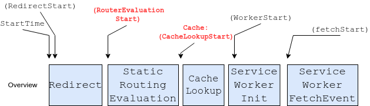
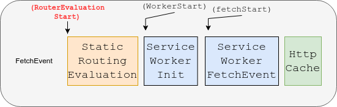
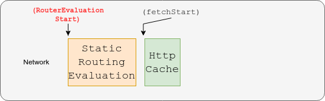
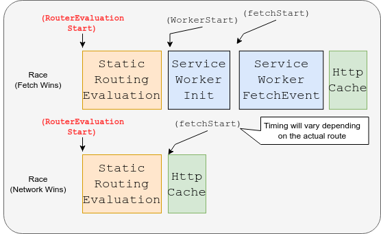
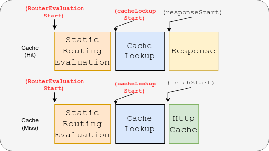

# Explainer for timing info for Static Routing API

## Authors

Keita Suzuki (@quasi-mod)

Yoshisato Yanagisawa (@yoshisatoyanagisawa)


## Participate

*   [Link to issue](https://github.com/WICG/service-worker-static-routing-api/issues/19)

## Abstract

*   Introduce timing info for the ServiceWorker Static Routing API in Resource Timing API and Navigation Timing API.


## Background


### The ServiceWorker Static Routing API

The startup of [ServiceWorkers](https://www.w3.org/TR/service-workers/), a web platform feature that brings application-like
experience to users, is known to be a slow process. If the ServiceWorker intercepts loading the page
resources, web users may need to wait for the startup to complete in order for the page loading to start.

[Service Worker Static Routing API](https://github.com/WICG/service-worker-static-routing-api) was introduced to mitigate this issue by letting the
developers selectively choose whether the ServiceWorker should intercept the
navigation, and allow them to specify when to not run ServiceWorker.
In addition, it allows the developers to offload simple ServiceWorker operations
like cache look up. i.e. they can return resources from CacheStorage without running
ServiceWorkers. 

### Timing Info of ServiceWorkers

Service Worker provides [timing information](https://w3c.github.io/ServiceWorker/#service-worker-timing) to mark certain points
in time. This is exposed and used by the [navigation timing API](https://w3c.github.io/navigation-timing/#dom-performancenavigationtiming)
as well as the [resource timing API](https://w3c.github.io/resource-timing/). It currently records two times:

*   Start time
*   Fetch event dispatch time

However, it currently does not have any fields related to the ServiceWorker Static
Routing API. Developers would benefit from having fields that provide information such as:

*   the matched route (the route that the Static Routing API evaluated)
*   the actual source from which the resource was retrieved
*   the time it took to match the route

This information will allow developers to measure the latency incurred by the Static
Routing API such as router evaluation time or time required to conduct cache lookup,
or determine if the matched source is the final source used (can find out if the
matched source failed to get the resource or not, and which source was used as
the alternative).

## Proposal



We add the following two timing information:

*   workerRouterEvaluationStart
    *   A `DOMHighResTimeStamp`, initially 0
    *   Time to start matching a request with registered router rules
*   workerCacheLookupStart
    *   A `DOMHighResTimeStamp`, initially 0
    *   Time to start looking up the cache storage if the source is "cache"

In addition to the timestamp information, we also add the following two route source information:

*   matchedRouterSource
    *   A `RouterSource`, initially empty string
    *   The enum string of the matched source (the source of result of router evaluation)
        *   This shall match to "network", "cache", "fetch-event", or "race-network-and-fetch-handler". If no rule is matched, it shall be an empty string.
*   finalRouterSource
    *   A `RouterSource`, initially empty string
    *   The enum string of the used source
        *   This shall match to "network", "cache", or "fetch-event"
        *   When a matched router source exists, this should match to the MatchedRouterSource, unless in "race-network-and-fetch-handler", where the winner of the race will be the final source (either "network" or "fetch-event"). Otherwise, it should remain as an empty string.


### Example code

#### Fetch Rule Specified



```js
// Add route inside ServiceWorker
addEventListener('install', (event) => {
  event.addRoutes({
    condition: {
      urlPattern: {pathname: "/form/*"}
    },
    source: "fetch-event"
  });
})
```

```js
// Measure routerEvaluationTime 
let timing = window.performance.timing;
let routerEvaluationTime = 0.0;
switch (timing.finalRouteSource) {
  case "network":
    // Indicates that the fetch fallback to network.
    routerEvaluationTime = timing.fetchStart - timing.workerRouterEvaluationStart;
    break;
  case 'fetch-event':
    routerEvaluationTime = timing.workerStart - timing.workerRouterEvaluationStart;
    break;
  case "cache":
    // UNREACHABLE
    break;
}
```

#### Network Rule Specified



```js
// Add route inside ServiceWorker
addEventListener('install', (event) => {
  event.addRoutes({
    condition: {
      urlPattern: {pathname: "/form/*"}
    },
    source: "network"
  });
})
```

```js
// Measure routerEvaluationTime 
let timing = window.performance.timing;
let routerEvaluationTime = 0.0;
switch (timing.finalRouteSource) {
  case "network":
    // Routed to network
    routerEvaluationTime = timing.fetchStart - timing.workerRouterEvaluationStart;
    break;
  case "cache":
  case "fetch-event":
    // UNREACHABLE
    break;
}
```

#### Race Rule Specified



```js
// Add route inside ServiceWorker
addEventListener('install', (event) => {
  event.addRoutes({
    condition: {
      urlPattern: {pathname: "/form/*"}
    },
    source: "race-network-and-fetch-event"
  });
})
```

```js
// Measure routerEvaluationTime 
let timing = window.performance.timing;
let routerEvaluationTime = 0.0;
switch (timing.finalRouteSource) {
  case "network":
    // Indicates that the network has won the race, 
    // or the fetch event has failed.
    routerEvaluationTime = timing.fetchStart - timing.workerRouterEvaluationStart;
    break;
  case 'fetch-event':
    // Indicates that the fetch has won the race.
    routerEvaluationTime = timing.workerStart - timing.workerRouterEvaluationStart;
    break;
  case "cache":
    // UNREACHABLE
    break;
}
```

#### Cache Rule Specified



```js
// Add route inside ServiceWorker
addEventListener('install', (event) => {
  event.addRoutes({
    condition: {
      urlPattern: {pathname: "/form/*"}
    },
    source: "cache"
  });
})
```

```js
// Measure routerEvaluationTime and cacheLookupTime
let timing = window.performance.timing;
let routerEvaluationTime = 0.0;
let cacheLookupTime = 0.0;
switch (timing.FinalRouteSource) {
  case "network":
    // Cache miss. Fallback to network. 
    routerEvaluationTime = timing.cacheLookupStart - timing.routerEvaluationStart;
    cacheLookupTime = time.fetchStart - time.workerCacheLookupStart;
    break;
  case "cache":
    // Cache Hit.
    routerEvaluationTime =
        timing.cacheLookupStart - timing.workerRouterEvaluationStart;
    cacheLookupTime =
        time.responseStart - time.cacheLookupStart;
  case "fetch-event":
    // UNREACHABLE
    break;
}
```

### Recorded timing per matched route

As mentioned above, the recorded fields will be different depending on the matched source. The fields to be recorded per source is as follows (✔ indicates recorded, ✘ indicates not recorded).


<table>
  <tr>
   <td colspan="2" style="background-color: null">
   </td>
   <td><code>RouterEvaluationStart</code>
   </td>
   <td><code>CacheLookupStart</code>
   </td>
   <td><code>fetchStart</code>
   </td>
  </tr>
  <tr>
   <td rowspan="5">Matched \
Source
   </td>
   <td>Fetch
   </td>
   <td style="background-color: #b6d7a8">✔
   </td>
   <td style="background-color: #f4cccc">✘
   </td>
   <td style="background-color: #b6d7a8">✔
   </td>
  </tr>
  <tr>
   <td>Network
   </td>
   <td style="background-color: #b6d7a8">✔
   </td>
   <td style="background-color: #f4cccc">✘
   </td>
   <td style="background-color: #b6d7a8">✔
   </td>
  </tr>
  <tr>
   <td>Race (Network vs Fetch)
   </td>
   <td style="background-color: #b6d7a8">✔
   </td>
   <td style="background-color: #f4cccc">✘
   </td>
   <td style="background-color: #b6d7a8">✔
   </td>
  </tr>
  <tr>
   <td>Cache
   </td>
   <td style="background-color: #b6d7a8">✔
   </td>
   <td style="background-color: #b6d7a8">✔
   </td>
   <td style="background-color: #f4cccc">✘
   </td>
  </tr>
  <tr>
   <td>None Matched
   </td>
   <td style="background-color: #b6d7a8">✔
   </td>
   <td style="background-color: #f4cccc">✘
   </td>
   <td style="background-color: #b6d7a8">✔
   </td>
  </tr>
</table>


### Correspondence of the Matched Source Type and the Actual Source Type

In some situations, the actual source type will be different from the matched source
type. This includes cases such as "race-network-and-fetch-event" where the result
of the race will be the actual route, or "cache" where a cache miss occurs.

The full list of correspondence of the matched source type and the actual source
type is as follows:


<table>
  <tr>
   <td rowspan="2" colspan="2">
   </td>
   <td colspan="3">Actual Source
   </td>
  </tr>
  <tr>
   <td>Fetch
   </td>
   <td>Network
   </td>
   <td>Cache
   </td>
  </tr>
  <tr>
   <td rowspan="5">Matched \
Source
   </td>
   <td>Fetch
   </td>
   <td>Fetch (Success)
   </td>
   <td style="background-color: #f4cccc">Network (Fallback: \
 Fetch handler is invalid)
   </td>
   <td style="background-color: #cccccc">N/A
   </td>
  </tr>
  <tr>
   <td>Network
   </td>
   <td style="background-color: #cccccc">N/A
   </td>
   <td>Network (Success)
   </td>
   <td style="background-color: #cccccc">N/A
   </td>
  </tr>
  <tr>
   <td>Race (Network vs Fetch)
   </td>
   <td>Fetch 
<p>
(Fetch win)
   </td>
   <td>Network (Network win or Fetch fallback)
   </td>
   <td style="background-color: #cccccc">N/A
   </td>
  </tr>
  <tr>
   <td>Cache
   </td>
   <td style="background-color: #cccccc">N/A
   </td>
   <td style="background-color: #f4cccc">Network (Fallback:
<p>
Cache Missed)
   </td>
   <td>Cache
<p>
(Cache hit)
   </td>
  </tr>
  <tr>
   <td>None matched
   </td>
   <td style="background-color: #cccccc">N/A (null)
   </td>
   <td style="background-color: #b7b7b7">N/A (null)
   </td>
   <td style="background-color: #b7b7b7">N/A
   </td>
  </tr>
</table>


## Discussions


### What to include in actual source when there is no matched source

When no matching rule is found, `matchedRouterSource` is an empty string, and we use
the ServiceWorker to fetch the resources. To indicate this case, there is a
discussion on what the `finalRouterSource` field should contain. We came up with
two possible solutions:

1. Set empty string to `finalRouterSource` as well
2. Set the actual source to `finalRouteSource` ("fetch-event" or "network", if it falls back)

We are currently planning to pursue Solution 1.

Solution 2 does expose more information to developers, but the exposed information
is independent from ServiceWorker Static Routing API as it is about whether
ServiceWorker fetch has succeeded or not. Although this should be taken into
consideration in the future, we concluded that such information would be out of
scope of Timing Info for the API.


### `fetchStart` on Cache Hit

When the cache is specified as the source and the resource is found in the cache
(cache hit), no fetch operation is performed. Therefore, fetchStart will not be set.
