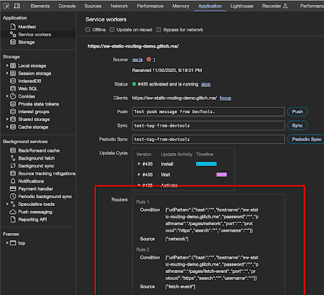
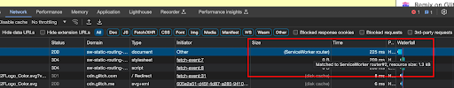

# What has been changed between the Chrome origin trial and M123?

As you can find in the [Chrome 123 beta blog](https://developer.chrome.com/blog/chrome-123-beta#service_worker_static_routing_api), 
Chrome M123 includes the ServiceWorker static routing API.  Based on feedback from the Origin Trial and progress in the implementation,
the following things have been updated since M117.
You can find the difference between M116 and M117 in [What has been changed between M116 and later?](https://github.com/WICG/service-worker-static-routing-api/blob/main/update-from-chrome-m116.md)

## API surface change

`InstallEvent.addRoutes()` replaces `InstallEvent.registerRouter()`.   The function signature is not changed, and you can just rename `registerRouter()` to
`addRoutes()`.  `registerRouter()` will be removed soon after M123.

The difference between them is whether it is allowed to be called multiple times or not. RegisterRouter() was explicitly designed to be called once,
because we would like to limit the case where the router registrations are distributed across multiple event handlers.  However, we received feedback
from the developer community that there are some cases where service worker scripts are delivered from a third party origin, and that can be provided
as a SDK. It is reasonable to assume that both first party and third party want to use the Static Routing API and register some routes. The new API shape
was discussed based on the community feedback ([issue comments](https://github.com/w3c/ServiceWorker/issues/1373#issuecomment-1667123029) and
[github issue](https://github.com/WICG/service-worker-static-routing-api/issues/10)).

## Behavior change on URLPattern condition

The router condition accepts the `urlPattern` field, which the input is eventually converted into the [URLPattern](https://urlpattern.spec.whatwg.org/)
object.  Since M116, both URLPattern API and the Service Worker static routing API are updated, and we believe the current behavior is much more intuitive.

Two major updates:

  1. Use [inherit left, wildcard right](https://github.com/whatwg/urlpattern/pull/198) behavior in base URL. 
  1. The main ServiceWorker script URL as a baseURL will be implicitly set when the input is a dictionary or a string, representing [URLPatternInput](https://urlpattern.spec.whatwg.org/#typedefdef-urlpatterninput). If the input is the URLPattern object constructed with `new URLPattern()`, the baseURL inheritance wouldn’t be applied. e.g. a pattern like `“/articles/*”` or `{‘pathname’: ‘*.png’}` will be affected.

## New conditions and sources

Following conditions and sources are newly added since M116.

* `condition`: 
  * `requestMethod`: A string containing a Request [method](https://developer.mozilla.org/docs/Web/API/Request/method).
  * `requestMode`: A string containing a Request [mode](https://developer.mozilla.org/docs/Web/API/Request/mode).
  * `requestDestination`: A string containing a Request [destination](https://developer.mozilla.org/docs/Web/API/Request/destination).
  * `runningStatus`: a string, either `”running”` or `”not-running”`.
* `source`: 
  * `"cache"`
  * `"fetch-event"`
  * `"race-network-and-fetch-handler"`
  * `cacheName`: A string containing the cache storage’s cacheName

e.g.
Directly goes to network for the POST method
```js
{
  condition: {requestMethod: ‘POST’},
  source: ‘network’
}
```

e.g.
Use cache storage for scripts, and fallbacks to network if cache misses.
```js
{
  condition: {requestDestination: ‘script’},
  source: ‘cache’’
}
```

e.g.
Run competition between network fetch and a fetch-handler for navigational requests.
```js
{
  condition: {requestMode: ‘navigate’},
  source: ‘race-network-and-fetch-handler’
}
```

e.g.
Use cache storage named “pictures” for files whose name ends with “.png” or “.jpg”.
```js
{
  condition: {
    or: [
      {urlPattern: “*.png”},
      {urlPattern: “*.jpg”}
    ]
  },
  source: {
    cacheName: “pictures”
  }
}
```

## DevTools support

### Show registered router rules

Registered router rules are displayed in the **Service Worker** Tab of the **Application** panel.



In the **Network** Panel, if the request matches the registered rule, this is indicated in the size column.
When holding the pointer over the size column, the registered router ID is shown.  Corresponding rules are displayed in the application tab.


